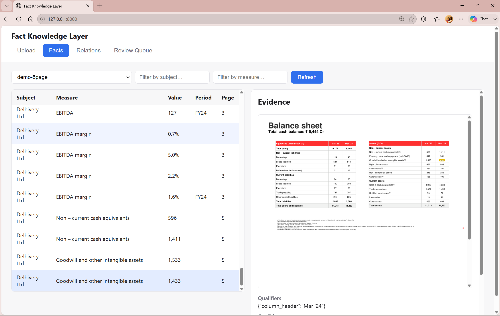

# Fact Knowledge Layer

Extracts numerical and semantic facts from PDFs, grounds every fact to verified evidence in its source document, and reconciles facts across documents — naming **which dimension** explains a difference rather than only flagging that one exists.

> Superjoin VIT 2026 · Engineering Intern Assignment

[**Demo video**]
(https://drive.google.com/file/d/10dtxX7kVaguw8RtJNrwitj83-nNk53e0/view?usp=sharing)



---

## Setup and Run Instructions

Requires Python 3.12+.

```bash
git clone https://github.com/01ayuvi/fact-knowledge-layer.git
cd fact-knowledge-layer

python -m venv .venv
.venv/Scripts/activate          # Windows
# source .venv/bin/activate     # macOS / Linux

pip install -r requirements.txt
```

Create a `.env` file in the project root:

```text
GROQ_API_KEYS=key1,key2,key3
GOOGLE_API_KEYS=key1,key2
```

Groq is the primary extraction provider and Gemini is the fallback. Either provider alone is sufficient to run the system; multiple keys improve resilience under rate limits.

Run the application:

```bash
python -m uvicorn apps.api.main:app --reload
```

Open <http://127.0.0.1:8000>. Upload a PDF and watch it ingest live; progress streams over SSE. Extracted facts, reconciled relations, and the grounding review queue are available through the UI tabs. The interactive API reference is at <http://127.0.0.1:8000/docs>.

### Offline demo mode

`data/store.db` is committed to this repo, already seeded with the full Delhivery corpus (facts, quarantined entries, and reconciled relations — including the FY24 revenue corroboration described in [The Four Required Cases](#the-four-required-cases)). **No API key is required to see a populated, working system** — cloning the repo and starting the server is enough. An API key is only needed to ingest a *new* PDF.

One-command setup (creates/reuses `.venv`, installs requirements, starts the server):

```bash
./scripts/demo.sh          # macOS / Linux
```

```powershell
.\scripts\demo.ps1         # Windows
```

Run the test suite:

```bash
pytest
```

**Current test status:** 118 tests passing.

---

## Video Demo

**Demo:** https://drive.google.com/file/d/10dtxX7kVaguw8RtJNrwitj83-nNk53e0/view?usp=sharing

The demo is under three minutes and shows:

1. PDF upload and ingestion
2. Fact extraction with source evidence
3. Cross-document corroboration
4. A genuine or likely contradiction
5. An apparent contradiction reconciled through context
6. An extraction failure and how the system handles it

---

## Approach

The system is designed around a simple principle:

> **A fact is only useful if we know exactly what was claimed, where it came from, and how it compares with other claims.**

Rather than treating the PDFs as a search corpus or asking an LLM to directly decide whether documents agree, the pipeline separates **extraction, grounding, normalization, linking, and reconciliation**.

The LLM is used where language understanding is useful. Deterministic code is used where the result needs to be reproducible, testable, and auditable.

```text
PDFs
  │
  ▼
Layout-aware ingestion
  │
  ▼
LLM fact extraction
  │
  ▼
Evidence grounding
  │
  ├── grounded → normalization
  │
  └── ungrounded → quarantine
  │
  ▼
Claim keys + candidate linking
  │
  ▼
Deterministic reconciliation
  │
  ├── CORROBORATES
  ├── CONTRADICTS
  ├── RECONCILED_BY_CONTEXT
  ├── SUPERSEDES
  └── REFINES
  │
  ▼
LLM explanation
  │
  ▼
API / UI
```

### The fact model

A Fact represents a **claim**, not just a value.

Each Fact contains:

- **Subject** — the entity the claim is about
- **Measure** — what is being measured or stated
- **Value** — raw value plus normalized number, unit, and scale
- **Qualifiers** — an open-ended set of dimensions such as period, consolidation, geography, modality, and basis
- **Validity interval** — when the claim applies
- **Evidence** — source document, page, character offsets, bounding box, and quoted text

The qualifier model is intentionally open rather than limited to a fixed schema. New documents can introduce dimensions that were not present in the starter dataset without requiring a schema migration.

This matters because the value alone is not always the fact.

For example, the Delhivery FY24 annual report reports revenue from operations as **₹74,540.82 million and ₹81,415.38 million on the same page**. The figures differ by approximately 9%, but both are correct: the values belong to the **Standalone** and **Consolidated** columns respectively. A system that reads the number without its column header could incorrectly classify them as contradictory.

Similarly, context can make apparently different period references equivalent. The IMF Article IV report states **7.8% real GDP growth** for both **"the first quarter of FY2025/26"** and **"2025Q2"**. These references describe the same quarter under different calendar conventions. A comparison system needs to normalize the period context before treating the claims as different.

### PDF ingestion and layout handling

PDFs are processed with PyMuPDF at block level while retaining geometry rather than flattening each document into plain text.

A page-type router classifies content as **prose, table, or slide**. This allows extraction to preserve the structure appropriate to the source instead of applying one extraction strategy to every page.

For tables, PyMuPDF frequently fragments visually related cells into separate text blocks. The system reconstructs rows and columns using their geometric positions and propagates column headers into the resulting facts as qualifiers. This preserves distinctions that would otherwise be lost during text extraction.

### Grounding

The LLM is allowed to propose facts, but it is **not trusted to provide its own evidence location**.

Before a fact is stored, its quoted evidence is fuzzy-matched against the original extracted source block using NFKC normalization, RapidFuzz matching, and position mapping.

The system records the document, page, source quote, character offsets, and bounding box.

If the evidence cannot be reliably grounded, the fact is **quarantined rather than silently accepted or discarded**.

This creates an important invariant:

> **A stored fact must be traceable back to evidence in the source document.**

The grounding gate therefore acts as a boundary between model-generated proposals and facts that are allowed into the knowledge layer.

### Normalization and claim linking

Documents frequently express the same concept differently. Periods, units, scales, entities, and measure names therefore need to be normalized before facts can be compared reliably. The original representation is retained for auditability, while deterministic normalization creates comparable forms.

Facts are then assigned a normalized **claim key** based on their subject, measure, and relevant qualifiers. Candidate linking uses indexed exact and loose claim keys to identify facts that are likely describing the same underlying claim. This avoids comparing every extracted fact with every other fact and keeps cross-document reasoning bounded as the knowledge layer grows.

### Reconciliation

The central design decision is to **separate semantic interpretation from the final decision**.

The LLM handles language-dependent tasks such as extracting claims, interpreting document context, deriving contextual information, and writing human-readable explanations.

The final relationship verdict is produced by deterministic comparison rules over normalized facts and their qualifiers.

Possible relationships include:

- `CORROBORATES` — independently supported claims agree
- `CONTRADICTS` — claims describe the same context but their assertions or values diverge
- `RECONCILED_BY_CONTEXT` — the apparent difference is explained by a qualifier such as period, scope, unit, or basis
- `SUPERSEDES` — a later claim represents a newer state of the same fact
- `REFINES` — one claim provides additional specificity without contradicting the other

When facts differ, the system also emits a **machine-readable reason code** identifying the dimension responsible for the difference. Examples include `SCALE_NORMALIZED`, `SCOPE_MISMATCH`, `PERIOD_BASIS_MISMATCH`, `TEMPORAL_STATE_CHANGE`, `VINTAGE_RESTATEMENT`, `ROUNDING_ARTIFACT`, and `VALUES_DIVERGE`.

The purpose is to answer not only "are these facts different?" but **"which dimension explains why they are different?"**

The LLM then writes the natural-language explanation after the relationship has already been decided. Its explanation response contains only the explanation field, preventing the model from overriding the deterministic verdict.

### Why deterministic reconciliation?

An LLM can understand language well, but using it as the final authority for contradiction detection makes results harder to reproduce and audit.

The deterministic reconciler ensures that the same normalized inputs produce the same verdict, while reason codes and qualifier comparisons remain independently testable.

The resulting boundary is: **LLM for language understanding → deterministic code for factual comparison → LLM for explanation.**

### Engineering decisions

**Page-type routing.** Prose, tables, and presentation slides expose information differently. The router preserves these distinctions so extraction can use the appropriate context.

**Geometry-aware table reconstruction.** Tables are reconstructed from block positions because the PDF text layer does not necessarily preserve visual table structure. Column headers are retained as qualifiers so facts from different columns remain distinguishable.

**Deterministic normalization.** Period, unit, scale, and related normalization is implemented outside the LLM where possible. This makes normalization testable and prevents equivalent representations from becoming separate claims.

**Content-hash caching.** Extraction results are cached by document content hash and prompt version, so re-ingesting unchanged material avoids unnecessary API calls.

**Provider resilience.** Groq is the primary extraction provider, with Gemini fallback and key rotation. Rate-limit handling distinguishes temporary per-minute limits from exhausted quotas and applies different recovery behavior.

**Incremental ingestion.** New documents can be added without rebuilding the entire knowledge layer. Facts are persisted per batch so completed work survives a later failure.

**Retrieval-bounded linking.** Candidate comparison is restricted to plausible matches rather than performing an unrestricted all-against-all comparison. This keeps linking practical as the number of documents and facts grows.

### What I deliberately did not build

**Graph database as the primary store.** The assignment explicitly warns that a graph database or visualization alone is not the solution — the important part is how facts are discovered, grounded, compared, and explained. I therefore use SQLite for the primary fact and relation store and expose the relationships through the API and UI rather than making the graph itself the product.

**Fixed-size chunking.** Fixed-size text chunks are convenient for generic RAG systems but can destroy the structural context needed here. A table row, column header, footnote, and surrounding section may all be necessary to interpret a single fact. The ingestion pipeline therefore works with layout-aware blocks and page structure.

**Embedding similarity as a contradiction signal.** Embedding similarity is useful for semantic retrieval, but cosine distance does not understand factual dimensions such as fiscal year, consolidation, unit, or reporting scope. Two semantically similar statements can legitimately refer to different periods or scopes. Embeddings can assist candidate discovery, but they should not decide whether two claims contradict each other.

### How I verified this

The system has been tested both with automated tests and by running it against the actual starter documents. Two important failures were discovered during execution rather than review.

First, PyMuPDF fragmented table rows into separate line entries when cells were widely spaced, so a row-level check never saw more than one numeric cell at a time and the annual report initially produced zero table pages. This was a grouping problem rather than a pattern-matching one, and led to the geometry-based row and column reconstruction described above.

Second, Groq was found to truncate a response mid-JSON when `max_completion_tokens` was not configured. The truncated JSON was then rejected as a non-retryable 400, producing a zero-fact batch without the underlying failure being surfaced clearly. This resulted in explicit completion-token limits, bounded batches, retries, caching, and provider fallback.

The current automated test count is **118**.

---

## The Four Required Cases

Full evidence, source quotes, and reasoning traces are documented in [`docs/FOUR_CASES.md`](docs/FOUR_CASES.md).

| # | Case | Verdict / reason code | Evidence |
|---|------|----------------------|----------|
| 1 | Corroborated across documents, expressed differently | `CORROBORATES` / `SCALE_NORMALIZED` (caveated — linked via measure aliasing) | Annual Report FY24 p22 `"81,415.38"` (₹ million, consolidated) vs Q4 deck p17 `"8,142"` (₹ crore) — 0.006% apart after scale normalization |
| 2 | Genuine or likely contradiction | `CONTRADICTS` / `VALUES_DIVERGE` — **see caveat below** | Annual Report FY24 p24: board meeting `"August 04, 2023"` vs `"August 24, 2023"` |
| 3 | Apparent contradiction explained by context | `RECONCILED_BY_CONTEXT` / `SCOPE_MISMATCH` | Annual Report FY24 p22, same measure and period: Standalone `"74,540.82"` vs Consolidated `"81,415.38"` |
| 4 | Extraction or reasoning failure found and handled | Claim-key over-collapse: `CONTRADICTS` count dropped 107 → 2 | See [`docs/FOUR_CASES.md`](docs/FOUR_CASES.md) §4 |

**Caveat on Case 2, stated upfront rather than left to be discovered.** The two board-meeting dates share a single source block with no distinguishing qualifier, so these are almost certainly two separate meetings rather than a genuine conflict. The reconciler is behaving correctly given what it was told — the gap is upstream, in the same claim-key over-collapse pattern that Case 4 diagnoses and fixes, but without a `date` qualifier present for the fix to catch. A stronger contradiction case exists in the corpus (a director listed as active in the 2022 prospectus and as resigned in the FY24 annual report), but it cannot currently surface as a relation because of the unreachable-`SUPERSEDES` limitation documented below. Both are disclosed rather than papered over.

The demo shows the first three with their source evidence and the system's reasoning. The fourth demonstrates a failure discovered during real execution and the corresponding mitigation.

---

## Limitations and Next Steps

The current system is intentionally conservative: when extraction or grounding is unreliable, it prefers to surface uncertainty rather than silently create a fact.

Every observed limitation below was found by running the system against the corpus, not by inspection.

### Observed limitations

**Chart and slide extraction.** Text-layer extraction preserves chart labels and numbers but does not always preserve their visual bindings. A Delhivery earnings-deck page extracts as `7,054 7,224 8,142 FY22 FY23 FY24` — all values survive, but the association between each value and its year is lost. The page router correctly identifies the page as a slide, but vision-based extraction is not currently implemented, so these cases are skipped rather than producing potentially incorrect facts.

**Layout-based table classification.** The table router can mistake mathematical notation for tabular content. RBI pages containing regression equations such as `+ β2 (NonBank * Spreads,t)` were classified as tables because the spatial distribution of the tokens resembles widely spaced numeric cells. This demonstrates that geometry alone is not sufficient for every page type.

**Footnote-carried qualifiers.** Some facts depend on qualifiers stated elsewhere on the page rather than immediately beside the value — for example `(2) FY22 numbers are on pro forma basis`, or `$ : GDP for 2024-25 is as per second advance estimates`. The current pipeline handles some of these relationships, but same-page footnote resolution is not yet comprehensive.

**Value duplication on qualitative assertions.** 41 of 249 facts extracted from the Delhivery annual report have `measure_surface_form` identical to `value_raw`, predominantly `categorical` and `assertion` facts drawn from narrative prose where there is no discrete value separate from the claim itself. Numeric facts are largely unaffected. The extraction schema currently requires both fields, so the model duplicates the sentence into each. The cleaner solution is to make `value_raw` optional for non-numeric fact types, but that change would require re-extraction and was deferred.

**Unreachable relation type: `SUPERSEDES`/`TEMPORAL_STATE_CHANGE`.** Implemented, tested, and unreachable in practice. Extraction never populates `Fact.validity_interval`, so it defaults to `(None, None)`, which the overlap check reads as fully overlapping — the supersession branch can never fire on real data. The rules unit test passes because it constructs validity intervals by hand, which nothing upstream does. Found by attempting the director state-change case end-to-end (2022 prospectus vs. FY24 annual report resignation note) rather than trusting the unit test — the pair reconciled as `UNRESOLVED`, not `SUPERSEDES`. The fix is to derive validity intervals from qualifiers during extraction, which was not attempted under time constraints. See `docs/LIMITATIONS.md` for the full write-up.

**Provider failures.** Groq was found to truncate output mid-JSON when `max_completion_tokens` was not configured; the malformed response was then rejected as a non-retryable 400 and produced a zero-fact batch without surfacing the underlying failure. Large batches also produced HTTP 413 payload errors. These findings led to bounded batches, explicit completion limits, retry handling, caching, and provider fallback. The pipeline now continues through total provider failure, logging failed batches rather than losing the documents already processed.

**Free-tier quota bounds throughput, not the pipeline.** A 100-page document requires roughly 200 LLM calls. Both Groq and Gemini free tiers were exhausted during final testing, which is precisely why the committed `store.db` and the content-hash cache exist: a reviewer can explore the entire knowledge layer, including every relation and its evidence, without an API key and without waiting on a provider. Ingesting a genuinely new document does require live quota.

**Incremental-ingest recovery.** Incremental skipping is currently keyed on document presence rather than successful completion, so a partially failed ingest may need to be cleared manually before it can be retried.

**Explanation throughput.** Natural-language explanations require one LLM call per relationship pair. In testing, 59 pairs took approximately 6.5 minutes under provider rate limiting, even after parallelizing across four workers. This is acceptable for a prototype but would become a bottleneck for larger knowledge layers.

### Anticipated limitations

These have not yet appeared in the starter corpus but follow from the current design.

**Entity canonicalization.** Entity matching currently relies on aliases and string normalization, so two genuinely different organizations with similar names could collide. At larger scale this should be supplemented with embeddings or an external entity registry.

**Candidate-linking recall.** Candidate linking is deliberately retrieval-bounded for efficiency, but this introduces a recall trade-off. If two facts describe the same claim using measure terminology that the normalizer does not recognize, they may never become comparison candidates. This failure is difficult to detect because there is no candidate pair for the reconciler to evaluate.

**Measure-specific rounding.** The current rounding tolerance is global. Different measures can require different tolerances, so a larger system should make tolerance rules measure-aware.

**Compound reason codes.** Relationships currently emit one primary reason code. Some differences are better explained by multiple qualifiers simultaneously — a claim can differ in both scope and period. Supporting multiple reason codes would make these explanations more faithful to the underlying evidence.

### Next steps

1. **Derive validity intervals during extraction** — this alone makes `SUPERSEDES` reachable and unlocks the director state-change case as a proper cross-document relation.
2. **Vision-assisted slide extraction** — recover visual bindings between chart labels, values, legends, and axes.
3. **Same-page footnote resolution** — associate footnote markers and explanatory text with the facts they qualify.
4. **Embedding-backed measure canonicalization** — improve candidate-linking recall when equivalent measures use terminology that deterministic normalization does not recognize.
5. **Batched explanation generation** — generate explanations for multiple already-decided relationships in fewer LLM calls, reducing rate-limit overhead and latency.

---

## Additional Notes

### Large PDFs

Extraction is cached by content hash and prompt version, so re-ingesting a processed document costs zero extraction API calls. This was verified live: **34 previously completed batches replayed from disk in under two seconds** before the run resumed real work at the exact batch where it had stopped.

Batches are bounded by both character count and block count, following oversized payloads that returned HTTP 413 from the provider. Facts persist per batch rather than per document, so a run that fails partway does not lose completed work. Explanation-writing is parallelized across a bounded thread pool.

**Corpus ingest:** 680 facts, 35 quarantined, 1,446 relations across 4 documents (prospectus 5, annual report 454, Q4 deck 118, demo extract 103). Relations by type: 1,386 RECONCILED_BY_CONTEXT, 48 CORROBORATES, 11 CONTRADICTS, 1 REFINES.

### Many PDFs in one knowledge layer

Candidate pairing uses indexed exact and loose claim keys, so adding a document compares its facts against plausible matches rather than the entire fact store. Adding the *n*th document therefore does not require *n*² comparisons.

### Incremental ingestion

Re-ingesting a successfully processed document short-circuits with zero LLM calls. A new document reconciles its own new candidate pairs while existing facts and relations remain untouched.

### Schema evolution

`qualifiers` is an open key-value bag persisted as JSON rather than a fixed set of database columns. A document introducing a new dimension — a new basis, scope, or vintage qualifier — therefore does not require a schema migration. The reconciler treats qualifiers as potential explanatory dimensions rather than assuming a fixed list of fields.

### Provider resilience

Groq is the primary provider, Gemini is the fallback, and both support multiple keys. Rate-limit handling distinguishes temporary per-minute limits from quota exhaustion: temporary limits back off on the same key, while exhausted keys are rotated out of the active pool.

During testing, Groq's quota behavior was observed to recover on a rolling window rather than requiring a fixed 24-hour reset, so the provider-reported recovery interval is used when cooling down exhausted keys.

Under total provider failure, the pipeline logs failed batches and continues rather than losing successfully processed work.

### AI tools used

- **Claude Code** — pair-programming and implementation assistance
- **Groq (`openai/gpt-oss-120b`)** — primary semantic fact extraction
- **Gemini** — document-context derivation and extraction fallback

Every model output is treated as a proposal. It passes through the grounding gate, deterministic normalization, and rule-based reconciliation before entering the knowledge layer.

### A note on design priorities

The system deliberately favors **traceability over apparent certainty**. If it cannot prove where a fact came from, it does not silently promote that claim into the knowledge layer. If two facts cannot be confidently reconciled, it preserves the uncertainty rather than forcing a binary contradiction.

The goal is not the largest possible set of extracted facts, but a set of facts whose evidence, context, relationships, and reasoning can be inspected and challenged.